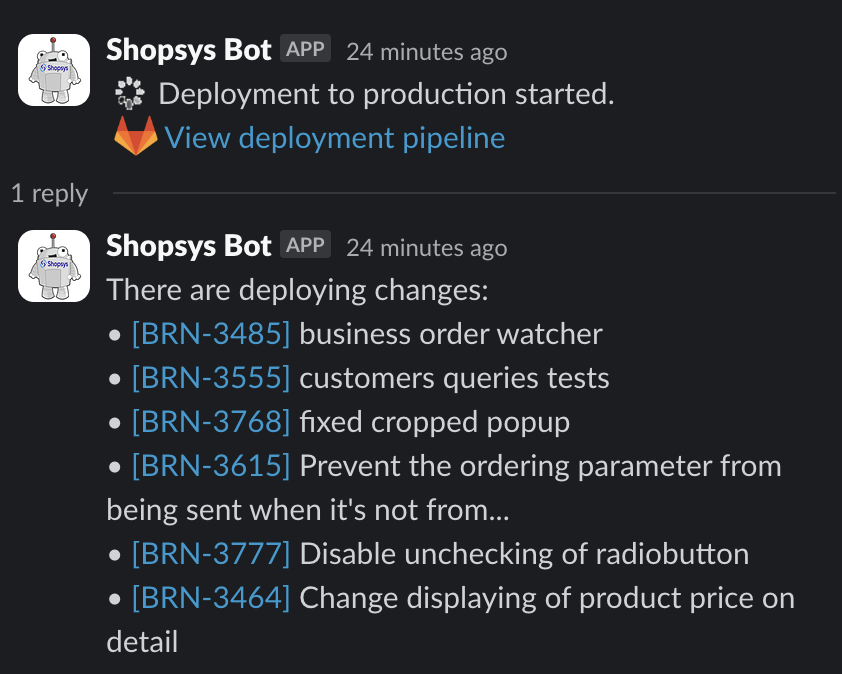
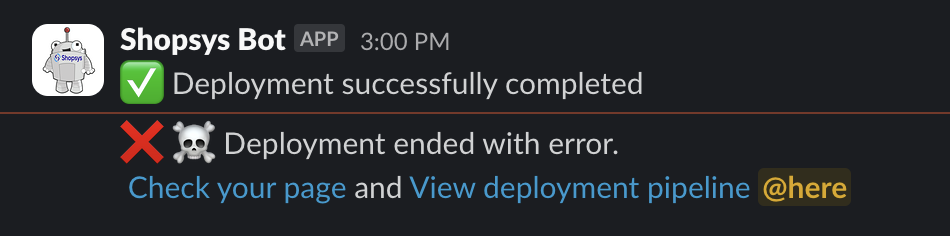

# Kubernetes Deployment

## How to install

1. Install package `composer require shopsys/deployment`

2. Copy [deploy-project.sh](./docs/deploy-project.sh) into your project to `deploy/deploy-project.sh` 

3. Create or [copy](./docs/basicHttpAuth) htpasswd file with login credentials to `deploy/basicHttpAuth` 
    > Default login for basicHttpAuth is `username/password`
      For info about how change http auth credentials see [Change HTTP auth](#change-http-auth) 

4. Update your `gitlab-ci.yml`
    - create new stage with name deploy:
        ```diff
        stages:
            - build
            - test
            - review
        +   - deploy
            - service
        ```
    - Add new deploy template:

        ```yaml
        .deploy: &deploy
            image:
                name: shopsys/kubernetes-buildpack:0.9
            stage: deploy
            tags:
                - docker
            rules:
                -   if: '$CI_PIPELINE_SOURCE == "schedule"'
                    when: never
            script:
                - docker create -ti --name image ${TAG} bash
                - docker cp image:/var/www/html/var/ ./
                - mkdir -p /root/.kube/ && echo "${KUBE_CONFIG}" > /root/.kube/config
                - chmod +x ./deploy/deploy-project.sh && ./deploy/deploy-project.sh deploy
        ```
    - Add new jobs for deploy devel and production:

        ```yaml
        deploy:production:
            <<: *deploy
            resource_group: deploy_production
            variables:
                KUBE_CONFIG: ${KUBE_CONFIG_PROD}
            needs:
                - build
            rules:
                -   if: '$CI_PIPELINE_SOURCE == "schedule"'
                    when: never
                -   if: '$CI_COMMIT_BRANCH == "master" || $CI_COMMIT_BRANCH =~ /^master-.*$/'
                    when: manual
                    allow_failure: false
            environment:
                name: production
                url: https://${DOMAIN_HOSTNAME_1}
        
        deploy:devel:
            <<: *deploy
            resource_group: deploy_devel
            variables:
                KUBE_CONFIG: ${KUBE_CONFIG_DEVEL}
            needs:
                - build
                - test:standards
                - test:functional
                - test:acceptance
            rules:
                -   if: '$CI_PIPELINE_SOURCE == "schedule"'
                    when: never
                -   if: '$CI_COMMIT_BRANCH == "devel" || $CI_COMMIT_BRANCH =~ /^devel-.*$/'
            environment:
                name: devel
                url: https://${DOMAIN_HOSTNAME_1}
        ```

5. Set Environment variables to in Gitlab (Settings -> CI/CD -> Variables)

6. Push changes and have fun

## Environment Variables

Environment variables can be set in Gitlab (Settings -> CI/CD -> Variables)

If you want to define your custom variables see [Define custom variables](#define-custom-variables) section

| Name                         | Example                          | Description                                                                                                                 |            Scope |
|:-----------------------------|----------------------------------|-----------------------------------------------------------------------------------------------------------------------------|-----------------:|
| DEPLOY_REGISTER_USER         | deploy                           | Credentials for downloading docker images *1)                                                                               |              All |
| DEPLOY_REGISTER_PASSWORD     | *******                          | Credentials for downloading docker images *1)                                                                               |              All |
| DISPLAY_FINAL_CONFIGURATION  | _1_ OR _0_                       | Display configurations after kubernetes scripts are prepared                                                                |              All |
| RUNNING_PRODUCTION           | _1_ OR _0_                       | Enable/disable HTTP auth and mailer whitelist                                                                               | production/devel |
| FIRST_DEPLOY                 | _1_ OR _0_                       | Set to 1 if you are deploying project instance first time                                                                   | production/devel |
| DOMAIN_HOSTNAME_*            | example.com                      | Variable contains URL address for accessing website. See  [Add more or less domains](#add-more-or-less-domains)             | production/devel |
| ELASTICSEARCH_URL            | username:password@elasticsearch  | Elasticsearch login URL                                                                                                     |              All |
| POSTGRES_DATABASE_IP_ADDRESS | 127.0.0.1                        | Postgres host IP address                                                                                                    | production/devel |
| POSTGRES_DATABASE_PORT       | 5432                             | Postgres port                                                                                                               |              All |
| POSTGRES_DATABASE_PASSWORD   | *******                          | Postgres login password                                                                                                     | production/devel |
| PROJECT_NAME                 | project-prod                     | Name of project (Used for namespace, prefixes and S3 bucket) - must be distinct for production/devel with prod/devel suffix | production/devel |
| S3_API_HOST                  | https://s3.vshosting.cloud       | S3 API Host                                                                                                                 |              All |
| S3_API_USERNAME              | s3user                           | S3 API username                                                                                                             |              All |
| S3_API_PASSWORD              | *******                          | S3 API password                                                                                                             |              All |
| APP_SECRET                   | *******                          | Used to add more entropy to security related operations                                                                     |              All |
| RABBITMQ_DEFAULT_USER        | rabbitadmin                      | Default user used for RabbitMQ and the management service                                                                   |              All |
| RABBITMQ_DEFAULT_PASS        | *******                          | Password for the default RabbitMQ user                                                                                      |              All |
| RABBITMQ_IP_WHITELIST        | 123.456.123.422, 423.534.223.234 | IP Addresses (separated by comma) for which is the RabbitMQ Management accessible                                           |              All |

*1) Credentials can be generated in Gitlab (Settings -> Repository -> Deploy Tokens) with `read_registry` scope only 

You can add your custom variables. *Do not forget to edit [deploy-project.sh](./docs/deploy-project.sh)*

## Customize deployment

You can override kubernetes manifests by place your custom manifest into `orchestration/kubernetes/` path in your project

*You need to mirror folders to be able to override manifests*

### Create new cron instance

1. Create new Phing target that will run your cron:
   ```xml
      <target name="cron-customers" description="....">
          <exec executable="${path.php.executable}" passthru="true" checkreturn="true">
              <arg value="${path.bin-console}" />
              <arg value="shopsys:cron" />
              <arg value="--instance-name=customers" />
          </exec>
      </target>
   ```
2. Declare new cron to your deploy configuration file [deploy-project.sh](./docs/deploy-project.sh):
   
   As a key there is used phing target that you created in step 1. and value represents [crontab timer](https://crontab.guru/#*/5_*_*_*_*)
   ```diff
       ...
       declare -A CRON_INSTANCES=(
           ["cron"]='*/5 * * * *'
   +       ["cron-customers"]='*/5 * * * *'
       )
       ...
   ```

### Add more or less domains

> This example will work with 3 domains

1. Create environment variable for every domain:

    | Name                          | Value                              |
    |:------------------------------|------------------------------------|
    | DOMAIN_HOSTNAME_1             | mydomain.prod.shopsys.cloud        |
    | DOMAIN_HOSTNAME_2             | sk.mydomain.prod.shopsys.cloud     |
    | DOMAIN_HOSTNAME_3             | en.mydomain.prod.shopsys.cloud     |

2. Edit [deploy-project.sh](./docs/deploy-project.sh)
    ```diff
    ...
    function deploy() {
        DOMAINS=(
            DOMAIN_HOSTNAME_1
            DOMAIN_HOSTNAME_2
    +       DOMAIN_HOSTNAME_3
        )
    ...
    ```

### Define custom variables

1. Create Environment variable
2. Edit [deploy-project.sh](./docs/deploy-project.sh)
    ```diff
    ...
    declare -A ENVIRONMENT_VARIABLES=(
        ["DATABASE_HOST"]=${POSTGRES_DATABASE_IP_ADDRESS}
        ["DATABASE_NAME"]=${PROJECT_NAME}
        ["DATABASE_PORT"]=${POSTGRES_DATABASE_PORT}
    )
    ...
    ```
   Left part is name of variable in application and right part is name of variable Gitlab.

### Set custom Redis version 

Add new variable to `deploy/deploy-project.sh` and specify your redis version

```diff
  ...
  BASIC_AUTH_PATH="${BASE_PATH}/deploy/basicHttpAuth"
  DEPLOY_TARGET_PATH="${BASE_PATH}/var/deployment/deploy"
+ REDIS_VERSION='redis:4.0-alpine'

  function deploy() {
  ...
```

### Enable Horizontal pod autoscaling

Add new variables to `deploy/deploy-project.sh` to enable pod autoscaling:

- Enable this functionality:
  ```diff
  ...
  function deploy() {
      DOMAINS=(
          DOMAIN_HOSTNAME_1
          ...
      )
    
  +   ENABLE_AUTOSCALING=true
  ...
  ```
- If you need more replicas, then you can adjust those variables (default values are set to 2):
  - `MIN_PHP_FPM_REPLICAS`
  - `MAX_PHP_FPM_REPLICAS`
  - `MIN_STOREFRONT_REPLICAS`
  - `MAX_STOREFRONT_REPLICAS`

### How to launch only some domains
  Add to `deploy/deploy-project.sh` new array `FORCE_HTTP_AUTH_IN_PRODUCTION` with domains which should be not accessible without HTTP auth:
      
  ```diff
  ...
      )
  
  +   # This setting has no effect when `RUNNING_PRODUCTION` is set to `0`
  +   FORCE_HTTP_AUTH_IN_PRODUCTION=(
  +       DOMAIN_HOSTNAME_2
  +   )
  
      declare -A ENVIRONMENT_VARIABLES=(
  ...
  ```

### Change HTTP auth

1. Generate new HTTP auth string (for example [here](https://www.web2generators.com/apache-tools/htpasswd-generator)), or by command `htpasswd -nb username password`
2. Replace or add new HTTP auth string to `deploy/basicHttpAuth`
3. Set new credentials to variable in `deploy/deploy-project.sh`
  ```diff
  ...
  function deploy() {
      DOMAINS=(
          DOMAIN_HOSTNAME_1
          ...
      )
    
  +   HTTP_AUTH_CREDENTIALS="username:password"
  ...
  ```

### Whitelist IP addresses

You need only to add IP address to `deploy/deploy-project.sh` to `WHITELIST_IPS` variable

*TIP:* It would be nice to have all IP addresses described like:
```shell
#              Some IP   Another IP    Some service
WHITELIST_IPS="8.8.8.8, 217.23.44.23, 93.111.234.111"
```

### Notify about deployment on Slack

You can enable automatic notification of your deployment directly into Slack channel. It has some features:

1. Notify about starting of deployment with a preview of features



> [!TIP]
> If you are using Jira and you use `[ABC-123]` in the commit message, it will automatically create a link to the URL that is specified by `JIRA_URL` environment variable

> [!TIP]
> Script will exclude commits that contain `!ignore` keyword

2. Notify about the end of deployment. There are two possible alerts - Success and Error



This script works only with Gitlab and Slack, but you can override `deploy/slack-notification.py` if you want to change behavior. For Slack, you have to create some Slack App with permissions (`chat:write`, `chat:write.public`).

There has to be set some environment variables list in the table bellow:

| ENVIRONMENT VARIABLE  | Additional information |
| -------------         | -------------          |
| `CI_API_V4_URL` | Automatic by Gitlab    |
| `CI_PROJECT_ID` | Automatic by Gitlab    |
| `CI_JOB_URL` | Automatic by Gitlab    |
| `CI_COMMIT_SHA` | Automatic by Gitlab    |
| `API_TOKEN` | Token for Gitlab API that has access to read deployments    |
| `JIRA_URL` | Set URL for link Jira ID to Jira.   |
| `SLACK_TOKEN` | Slack Bot User OAuth Token    |
| `SLACK_CHANNEL` | Channel ID to post messages into. This variable should be set only for production Environment   |
| `SLACK_DISABLE_CHANGES` | If set to `true`, no message with changes will be posted   |

### Run background jobs only on selected nodes

Backend pods such as RabbitMQ, Cron and Consumers can be run only on selected nodes. Those pods have already configured tolerations, so you can use taints to select nodes where those pods will be run.

Add taint to nodes where you want to run those pods
   ```shell
   kubectl label nodes <node-name> workload=background
   kubectl taint nodes <node-name> workload=background:NoSchedule
   ```

Other pods will run on other nodes without this taint.