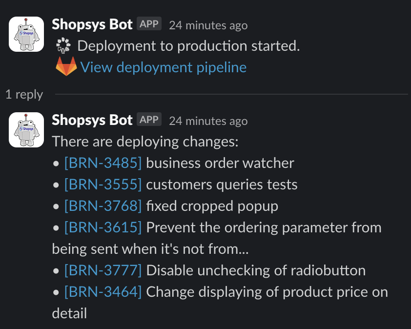
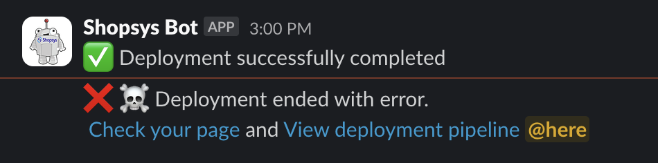

# Kubernetes Deployment

## How to install

1. Install package `composer require shopsys/deployment`

2. Copy [deploy-project.sh](https://github.com/shopsys/project-base/blob/HEAD/app/deploy/deploy-project.sh) into your project to `app/deploy/deploy-project.sh` 

3. Create or [copy](https://github.com/shopsys/project-base/blob/HEAD/app/deploy/basicHttpAuth) htpasswd file with login credentials to `app/deploy/basicHttpAuth` 
    > Default login for basicHttpAuth is `username/password`
      For info about how change http auth credentials see [Change HTTP auth](#change-http-auth) 

4. Copy [nginx.yaml](https://github.com/shopsys/project-base/blob/HEAD/app/orchestration/kubernetes/configmap/nginx.yaml) into your project to `app/orchestration/kubernetes/configmap/nginx.yaml`
5. Update your `gitlab-ci.yml`
    - create new stage with name deploy:
        ```diff
        stages:
            - build
            - test
            - review
        +   - deploy
            - service
        ```
    - Add new deploy template:

        ```yaml
        .deploy: &deploy
            image:
                name: shopsys/kubernetes-buildpack:2.0
            stage: deploy
            tags:
                - docker
            rules:
                -   if: '$CI_PIPELINE_SOURCE == "schedule"'
                    when: never
            script:
                - docker create -ti --name image ${TAG} bash
                - docker cp image:/var/www/html/var/ ./
                - mkdir -p /root/.kube/ && echo "${KUBE_CONFIG}" > /root/.kube/config
                - chmod +x ./deploy/deploy-project.sh && ./deploy/deploy-project.sh deploy
        ```
    - Add new jobs for deploy devel and production:

        ```yaml
        deploy:production:
            <<: *deploy
            resource_group: deploy_production
            variables:
                KUBE_CONFIG: ${KUBE_CONFIG_PROD}
            needs:
                - build
            rules:
                -   if: '$CI_PIPELINE_SOURCE == "schedule"'
                    when: never
                -   if: '$CI_COMMIT_BRANCH == "master" || $CI_COMMIT_BRANCH =~ /^master-.*$/'
                    when: manual
                    allow_failure: false
            environment:
                name: production
                url: https://${DOMAIN_HOSTNAME_1}
        
        deploy:devel:
            <<: *deploy
            resource_group: deploy_devel
            variables:
                KUBE_CONFIG: ${KUBE_CONFIG_DEVEL}
            needs:
                - build
                - test:standards
                - test:functional
                - test:acceptance
            rules:
                -   if: '$CI_PIPELINE_SOURCE == "schedule"'
                    when: never
                -   if: '$CI_COMMIT_BRANCH == "devel" || $CI_COMMIT_BRANCH =~ /^devel-.*$/'
            environment:
                name: devel
                url: https://${DOMAIN_HOSTNAME_1}
        ```

6. Set Environment variables to in Gitlab (Settings -> CI/CD -> Variables)

7. Push changes and have fun

## Environment Variables

Environment variables can be set in Gitlab (Settings -> CI/CD -> Variables)

If you want to define your custom variables see [Define custom variables](#define-custom-variables) section

| Name                         | Example                          | Description                                                                                                                 |            Scope |
|:-----------------------------|----------------------------------|-----------------------------------------------------------------------------------------------------------------------------|-----------------:|
| DEPLOY_REGISTER_USER         | deploy                           | Credentials for downloading docker images *1)                                                                               |              All |
| DEPLOY_REGISTER_PASSWORD     | *******                          | Credentials for downloading docker images *1)                                                                               |              All |
| DISPLAY_FINAL_CONFIGURATION  | _1_ OR _0_                       | Display configurations after kubernetes scripts are prepared                                                                |              All |
| RUNNING_PRODUCTION           | _1_ OR _0_                       | Enable/disable HTTP auth and mailer whitelist                                                                               | production/devel |
| FIRST_DEPLOY                 | _1_ OR _0_                       | Set to 1 if you are deploying project instance first time                                                                   | production/devel |
| DOMAIN_HOSTNAME_*            | example.com                      | Variable contains URL address for accessing website. See  [Add more or less domains](#add-more-or-less-domains)             | production/devel |
| ELASTICSEARCH_URL            | username:password@elasticsearch  | Elasticsearch login URL                                                                                                     |              All |
| POSTGRES_DATABASE_IP_ADDRESS | 127.0.0.1                        | Postgres host IP address                                                                                                    | production/devel |
| POSTGRES_DATABASE_PORT       | 5432                             | Postgres port                                                                                                               |              All |
| POSTGRES_DATABASE_PASSWORD   | *******                          | Postgres login password                                                                                                     | production/devel |
| PROJECT_NAME                 | project-prod                     | Name of project (Used for namespace, prefixes and S3 bucket) - must be distinct for production/devel with prod/devel suffix | production/devel |
| S3_API_HOST                  | https://s3.vshosting.cloud       | S3 API Host                                                                                                                 |              All |
| S3_API_USERNAME              | s3user                           | S3 API username                                                                                                             |              All |
| S3_API_PASSWORD              | *******                          | S3 API password                                                                                                             |              All |
| APP_SECRET                   | *******                          | Used to add more entropy to security related operations                                                                     |              All |
| RABBITMQ_DEFAULT_USER        | rabbitadmin                      | Default user used for RabbitMQ and the management service                                                                   |              All |
| RABBITMQ_DEFAULT_PASS        | *******                          | Password for the default RabbitMQ user                                                                                      |              All |
| RABBITMQ_IP_WHITELIST        | 123.456.123.422, 423.534.223.234 | IP Addresses (separated by comma) for which is the RabbitMQ Management accessible                                           |              All |
| USING_CLOUDFLARE             | _1_ OR _0_                       | Set to 1 if your site is using Cloudflare (enables IP whitelisting)                                                         | production/devel |
| MCP_INGRESS_ENABLED          | _1_ OR _0_                       | Set to 0 to disable the separate ingress publishing the MCP endpoints without HTTP basic auth (default: 1)                  | production/devel |
| MCP_IP_WHITELIST             | 203.0.113.0/24, 198.51.100.10/32 | VPN egress IP ranges allowed to access MCP; when empty, MCP access is not restricted by source IP                           | production/devel |
| ENABLE_CONSUMER_AUTOSCALING  | _true_ OR _false_                | Enable autoscaling of consumers by RabbitMQ queue backlog (default: false), see [Consumers](#consumers)                     | production/devel |

*1) Credentials can be generated in Gitlab (Settings -> Repository -> Deploy Tokens) with `read_registry` scope only 

You can add your custom variables. *Do not forget to edit your `deploy-project.sh` file*

## Customize deployment

You can override Kubernetes manifests by placing your custom manifests into `app/orchestration/kubernetes/` in your project.

*You need to mirror folders to be able to override manifests*

### Create new cron instance

1. Create new Phing target that will run your cron:
   ```xml
      <target name="cron-customers" description="....">
          <exec executable="${path.php.executable}" passthru="true" checkreturn="true">
              <arg value="${path.bin-console}" />
              <arg value="shopsys:cron" />
              <arg value="--instance-name=customers" />
          </exec>
      </target>
   ```
2. Declare new cron to your deploy configuration file (`deploy-project.sh`):
   
   As a key there is used phing target that you created in step 1. and value represents [crontab timer](https://crontab.guru/#*/5_*_*_*_*)
   ```diff
       ...
       declare -A CRON_INSTANCES=(
           ["cron"]='*/5 * * * *'
   +       ["cron-customers"]='*/5 * * * *'
       )
       ...
   ```

### Consumers

Consumers are Symfony Messenger workers (`messenger:consume`) deployed as `consumer-<name>` deployments.
By default they are declared in the `DEFAULT_CONSUMERS` array in `deploy-project.sh` in the format `<name>:<transports separated by space>:<replicas>`,
e.g. `"product-recalculation:product_recalculation_priority_high product_recalculation_priority_regular:1"`.
This way keeps working unchanged, but it cannot declare autoscaling - for that declare the consumers in `consumers.yaml` instead.

#### Declare consumers in consumers.yaml

1. Source the new part in the `deploy()` function of `deploy-project.sh` before `environment-variables.sh`,
   which injects the environment variables into the generated consumer deployments (the part fails the deploy when sourced too late):

   ```diff
   ...
       source "${DEPLOY_TARGET_PATH}/parts/domain-rabbitmq-management.sh"
   +   source "${DEPLOY_TARGET_PATH}/parts/consumers.sh"
       source "${DEPLOY_TARGET_PATH}/parts/environment-variables.sh"
   ...
   ```

2. Move the consumer declaration from `DEFAULT_CONSUMERS` to `app/deploy/consumers.yaml` and remove the array from `deploy-project.sh`:

   ```yaml
   consumers:
       -   name: product-recalculation                   # deployment is named consumer-<name>
           transports: [product_recalculation_priority_high, product_recalculation_priority_regular]
           replicas: 1                                   # static replicas count, used when consumer autoscaling is disabled
           autoscaling:                                  # optional, omit for a consumer with static replicas only
               minReplicas: 1                            # 0 allowed on a cluster with the HPAScaleToZero feature gate
               maxReplicas: 8                            # must be higher than minReplicas
               threshold: 500                            # target count of ready messages per pod
               queues: [product_recalculation_priority_high, product_recalculation_priority_regular]   # optional, defaults to transports
       -   name: email
           transports: [email_transport]
           replicas: 1
   ```

   | Field                     | Meaning                                                                                                                                                       |
   |:--------------------------|---------------------------------------------------------------------------------------------------------------------------------------------------------------|
   | `name`                    | Name of the deployment `consumer-<name>`: lowercase letters, digits and dashes, starting and ending with a letter or digit, at most 54 characters               |
   | `transports`              | Non-empty list of Symfony Messenger transport names passed to `messenger:consume` (same character rules as `autoscaling.queues`)                              |
   | `replicas`                | Static replicas count (integer, `0` allowed) used when consumer autoscaling is disabled                                                                       |
   | `autoscaling`             | Optional, omit it for a consumer that should always run with the static `replicas`                                                                            |
   | `autoscaling.minReplicas` | Lower bound of the autoscaler; `0` scales the consumer to zero pods while its queues are empty and needs the `HPAScaleToZero` feature gate on the cluster (the API server rejects `0` without it) |
   | `autoscaling.maxReplicas` | Upper bound of the autoscaler, must be higher than `minReplicas`                                                                                              |
   | `autoscaling.threshold`   | Target count of ready messages per pod, see [Enable consumer autoscaling](#enable-consumer-autoscaling)                                                        |
   | `autoscaling.queues`      | Non-empty list of RabbitMQ queue names watched by the autoscaler, defaults to `transports` - set it when the queue name differs from the transport name (see `config/packages/messenger.yaml`); letters, digits, `_`, `.` and `-`, starting and ending with a letter or digit, at most 63 characters |

> [!IMPORTANT]
> A project must use either `DEFAULT_CONSUMERS` or `consumers.yaml`. The deploy fails when `consumers.yaml` exists
> and the merge phase already generated consumer deployments (from `DEFAULT_CONSUMERS` or from `orchestration/kubernetes/deployments`).

The file is read during deploy, so changing replicas or thresholds does not need a rebuild of the image.
The whole declaration, including the autoscaling blocks, is validated on every deploy even when
`ENABLE_CONSUMER_AUTOSCALING` is not set. A mistake in the file therefore fails on any environment,
not only on the one with autoscaling enabled.

#### Enable consumer autoscaling

Consumers with an `autoscaling` block can be scaled by the count of messages waiting in their RabbitMQ queues instead of running a static number of replicas.
Each of them gets a Horizontal pod autoscaler (`autoscaling/v2`) over the external metric `rabbitmq_queue_backlog` (ready messages only),
summed over all `queues` of the consumer.

> [!IMPORTANT]
> The autoscalers need the external metric `rabbitmq_queue_backlog` (label `queue`, namespace-scoped)
> from the External Metrics API of the cluster. The Shopsys clusters provide it. Without the metric
> the autoscaler reports `ScalingActive: False`, keeps its consumer at `minReplicas` and never scales it up.

Set `ENABLE_CONSUMER_AUTOSCALING=true` as an environment variable of the environments that should scale (e.g. production only, default is `false`):

- enabled: an autoscaler is deployed for every consumer with an `autoscaling` block and `replicas` is omitted from its deployment, so the autoscaler owns the replicas count
- disabled: consumers run with the static `replicas`, so the variable works as a kill switch

Existing autoscalers are updated in place by the deploy.
A renamed consumer leaves its old deployment `consumer-<old name>` behind (kubectl apply does not prune), delete it manually (this applies to `DEFAULT_CONSUMERS` as well).

> [!NOTE]
> The first deploy of a consumer with an autoscaler (after enabling the flag or after adding its `autoscaling` block) resets it to 1 replica for a moment: removing `replicas` from a deployment
> that was previously applied with a static count makes the API server fall back to the default, until the new autoscaler reconciles (within its 15 s sync period).
> Do it outside of peak hours if that matters. Later deploys keep the replicas set by the autoscaler.

`threshold` is the target count of ready messages per pod. A useful rule of thumb is the count of messages one pod processes in about a minute (per-pod throughput × 60 s):
with a threshold of `500` and 2000 ready messages the autoscaler runs 4 pods, with an empty queue it scales down to `minReplicas`.
Scale-up is immediate, scale-down starts after 5 minutes of stabilization and removes at most 1 pod per 2 minutes.

The scaling behavior and the metric name live in `kubernetes/manifest-templates/consumer-hpa.template.yaml` and can be overridden in `orchestration/kubernetes/manifest-templates/` as any other manifest.

### Add more or less domains

> This example will work with 3 domains

1. Create environment variable for every domain:

    | Name                          | Value                              |
    |:------------------------------|------------------------------------|
    | DOMAIN_HOSTNAME_1             | mydomain.prod.shopsys.cloud        |
    | DOMAIN_HOSTNAME_2             | sk.mydomain.prod.shopsys.cloud     |
    | DOMAIN_HOSTNAME_3             | en.mydomain.prod.shopsys.cloud     |

2. Edit your `deploy-project.sh` file:
    ```diff
    ...
    function deploy() {
        DOMAINS=(
            DOMAIN_HOSTNAME_1
            DOMAIN_HOSTNAME_2
    +       DOMAIN_HOSTNAME_3
        )
    ...
    ```

### Define custom variables

1. Create Environment variable
2. Edit your `deploy-project.sh` file:
    ```diff
    ...
    declare -A ENVIRONMENT_VARIABLES=(
        ["DATABASE_HOST"]=${POSTGRES_DATABASE_IP_ADDRESS}
        ["DATABASE_NAME"]=${PROJECT_NAME}
        ["DATABASE_PORT"]=${POSTGRES_DATABASE_PORT}
    )
    ...
    ```
   Left part is name of variable in application and right part is name of variable Gitlab.

### Set custom Redis version 

Add new variable to `deploy-project.sh` and specify your redis version

```diff
  ...
  BASIC_AUTH_PATH="${BASE_PATH}/deploy/basicHttpAuth"
  DEPLOY_TARGET_PATH="${BASE_PATH}/var/deployment/deploy"
+ REDIS_VERSION='redis:4.0-alpine'

  function deploy() {
  ...
```

### Enable Horizontal pod autoscaling

Add new variables to `deploy-project.sh` to enable pod autoscaling:

- Enable this functionality:
  ```diff
  ...
  function deploy() {
      DOMAINS=(
          DOMAIN_HOSTNAME_1
          ...
      )
    
  +   ENABLE_AUTOSCALING=true
  ...
  ```
- If you need more replicas, then you can adjust those variables (default values are set to 2):
  - `MIN_PHP_FPM_REPLICAS`
  - `MAX_PHP_FPM_REPLICAS`
  - `MIN_STOREFRONT_REPLICAS`
  - `MAX_STOREFRONT_REPLICAS`

### How to launch only some domains
  Add to `deploy-project.sh` new array `FORCE_HTTP_AUTH_IN_PRODUCTION` with domains which should be not accessible without HTTP auth:
      
  ```diff
  ...
      )
  
  +   # This setting has no effect when `RUNNING_PRODUCTION` is set to `0`
  +   FORCE_HTTP_AUTH_IN_PRODUCTION=(
  +       DOMAIN_HOSTNAME_2
  +   )
  
      declare -A ENVIRONMENT_VARIABLES=(
  ...
  ```

### Change HTTP auth

1. Generate new HTTP auth string (for example [here](https://www.web2generators.com/apache-tools/htpasswd-generator)), or by command `htpasswd -nb username password`
2. Replace or add new HTTP auth string to `basicHttpAuth`
3. Set new credentials to variable in `deploy-project.sh`
  ```diff
  ...
  function deploy() {
      DOMAINS=(
          DOMAIN_HOSTNAME_1
          ...
      )
    
  +   HTTP_AUTH_CREDENTIALS="username:password"
  ...
  ```

### Whitelist IP addresses

There are two ways to set whitelisted IP addresses.

#### `WHITELIST_IPS` env variable on CI

You can set sensitive whitelisted IPs in your env variable like this:

```shell
WHITELIST_IPS="8.8.8.8, 217.23.44.23, 93.111.234.111"
```

#### `DEFAULT_WHITELIST_IPS` env variable in `deploy-project.sh`

For non-sensitive IPs, that you want to share between all environments you can use `DEFAULT_WHITELIST_IPS` in `deploy-project.sh` like this:

```shell
#                      Some IP   Another IP    Some service
DEFAULT_WHITELIST_IPS="8.8.8.8, 217.23.44.23, 93.111.234.111"
```

Values from both variables (`WHITELIST_IPS` and `DEFAULT_WHITELIST_IPS`) will be merged and used in the final configuration.

### Configure Cloudflare

If your site is using Cloudflare, you can restrict direct access and allow traffic only through Cloudflare:

1. Enable Cloudflare protection by setting the environment variable `USING_CLOUDFLARE=1`.
2. By default, ALL domains will be protected. If you need to exclude specific domains from Cloudflare protection (e.g., for direct access or testing), add them to the `CLOUDFLARE_EXCLUDED_DOMAINS` array:
   ```diff
   ...
   +   CLOUDFLARE_EXCLUDED_DOMAINS=(
   +       DOMAIN_HOSTNAME_2  # This domain will not have Cloudflare IP restrictions
   +   )
   ...
   ```

This prevents users from bypassing Cloudflare by accessing your origin server directly.

### Notify about deployment on Slack

You can enable automatic notification of your deployment directly into Slack channel. It has some features:

1. Notify about starting of deployment with a preview of features



> [!TIP]
> If you are using Jira and you use `[ABC-123]` in the commit message, it will automatically create a link to the URL that is specified by `JIRA_URL` environment variable

> [!TIP]
> Script will exclude commits that contain `!ignore` keyword

2. Notify about the end of deployment. There are two possible alerts - Success and Error



This script works only with Gitlab and Slack, but you can override `deploy/slack-notification.py` if you want to change behavior. For Slack, you have to create some Slack App with permissions (`chat:write`, `chat:write.public`).

There has to be set some environment variables list in the table bellow:

| ENVIRONMENT VARIABLE  | Additional information |
| -------------         | -------------          |
| `CI_API_V4_URL` | Automatic by Gitlab    |
| `CI_PROJECT_ID` | Automatic by Gitlab    |
| `CI_JOB_URL` | Automatic by Gitlab    |
| `CI_COMMIT_SHA` | Automatic by Gitlab    |
| `API_TOKEN` | Token for Gitlab API that has access to read deployments    |
| `JIRA_URL` | Set URL for link Jira ID to Jira.   |
| `SLACK_TOKEN` | Slack Bot User OAuth Token    |
| `SLACK_CHANNEL` | Channel ID to post messages into. This variable should be set only for production Environment   |
| `SLACK_DISABLE_CHANGES` | If set to `true`, no message with changes will be posted   |

### Run background jobs only on selected nodes

Backend pods such as RabbitMQ, Cron and Consumers can be run only on selected nodes. Those pods have already configured tolerations, so you can use taints to select nodes where those pods will be run.

Add taint to nodes where you want to run those pods
   ```shell
   kubectl label nodes <node-name> workload=background
   kubectl taint nodes <node-name> workload=background:NoSchedule
   ```

Other pods will run on other nodes without this taint.
